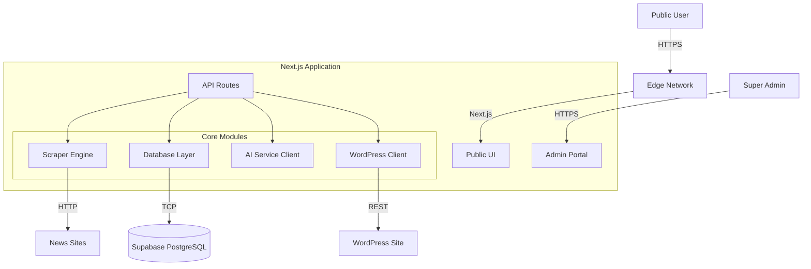

# 02. System Architecture

> **Project**: The Curator (Global News Aggregator)
> **Status**: Draft
> **Last Updated**: 2025-12-01

## 1. High-Level Architecture

The system follows a **Monolithic Modular Architecture** built on Next.js. While it is a single deployable unit, the internal logic is strictly separated into modules to allow for future decoupling (e.g., moving the Scraper to a standalone microservice).

## 2. Technology Stack

### 2.1 Frontend
*   **Framework**: Next.js 15 (App Router)
*   **Language**: TypeScript 5.x
*   **Styling**: Tailwind CSS 4.x
*   **Icons**: Lucide React
*   **State Management**: React Server Components (RSC) + Server Actions

### 2.2 Backend (API)
*   **Runtime**: Node.js (via Next.js API Routes)
*   **Scraping**: 
    *   `axios`: HTTP Client
    *   `cheerio`: HTML Parsing
*   **Validation**: `zod` (Recommended for strict schema validation)

### 2.3 Database
*   **Platform**: Supabase
*   **Engine**: PostgreSQL 15+
*   **ORM/Query Builder**: `@supabase/supabase-js`

### 2.4 Infrastructure
*   **Hosting**: Vercel (Recommended) or any Node.js compatible host.
*   **Auth**: Supabase Auth.
*   **Automation**: Vercel Cron Jobs (or GitHub Actions) to trigger API endpoints.

## 3. Module Boundaries & Isolation

Each major module is mapped to a user story and designed for isolation:

### 3.1 Web Application (`@/app/(public)`)
*   **Responsibility**: Public-facing pages for news display.
*   **Isolation**: Operates independently; does not require admin portal or scraper to function.

### 3.2 Admin Portal (`@/app/admin`)
*   **Responsibility**: Admin UI pages for article management.
*   **Isolation**: Can be developed and tested separately from the public site and other modules.

### 3.3 API Layer (`@/lib/db`)
*   **Responsibility**: All CRUD operations and database communication.
*   **Isolation**: All modules interact with the database only via the API, ensuring clear boundaries.

### 3.4 Scraper Engine (`@/lib/scraper`)
*   **Responsibility**: Fetching and parsing HTML, collecting news article URLs and metadata.
*   **Isolation**: Scraper logic is isolated and can run independently, storing results via the API.

### 3.5 WordPress Integration (`@/lib/wp`)
*   **Responsibility**: Exporting articles to external WordPress site.
*   **Isolation**: Export logic is isolated and can be triggered independently from other modules.

**Isolation Principle:**
Each module must be independently deployable, testable, and maintainable. No module should require direct access to another module’s internals; all communication occurs via well-defined API endpoints.

## 4. Automation Strategy (The "Better Solution")
*   **Problem**: Browser-based automation (`/auto1`) is unreliable.
*   **Solution**: **Vercel Cron** triggers a secure API endpoint (`/api/cron/trigger`) every hour. This runs entirely on the server.

## 5. Database Management Strategy
*   **Requirement**: Admin must be able to recreate/reset the schema from the Portal.
*   **Implementation**:
    *   **Migration Script**: A SQL file (`/supabase/schema.sql`) stored in the project.
    *   **Admin API**: `POST /api/admin/db-reset`.
    *   **Logic**: The API reads `schema.sql` and executes it against Supabase using the `postgres` connection (requires high-level privileges).
    *   **Safety**: Protected by "Super Admin" role and a "Double Confirmation" UI.

## 6. Why this Tech Stack?
*   **Next.js 15**: Provides **Server Actions** (easy backend logic) and **SSR** (perfect for SEO on the Public View).
*   **Supabase**: A full Postgres database that is easier to manage than raw SQL, with built-in Auth.
*   **Vercel Cron**: The missing piece for reliable news extraction.
*   **Tailwind**: Ensures the "Premium Magazine" look is easy to build and maintain.

